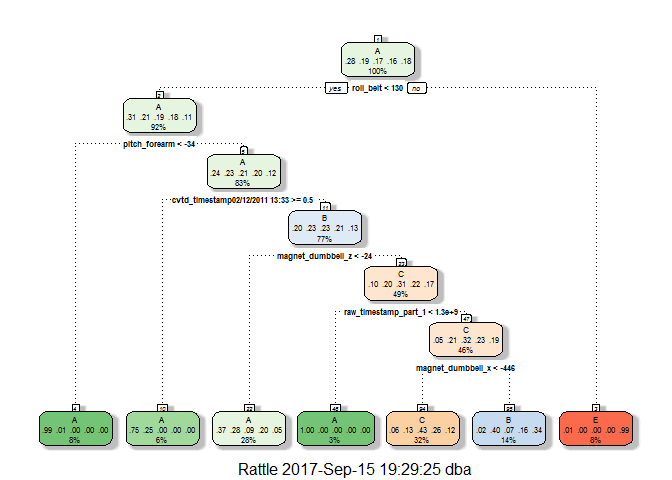

# Coursera Practical Machine Learning Course Project
DB  
September 5, 2017  

## Synopsis
The goal of this project is to predict the manner in which subjects in a study performed exercises. This is the "classe" variable in the training dataset. This report describes how we processed our data and how we built models. The model with the highest accuracy was chosen to predict the 20 different cases in our test dataset.

## Data Processing
This step describes how the data were loaded into R and processed for analysis.

```r
# Read data into R
setwd("~/Coursera/Course 8 - Practical Machine Learning")

url_training <- "https://d396qusza40orc.cloudfront.net/predmachlearn/pml-training.csv"
download.file(url = url_training, destfile = "pml-training.csv")

url_test <- "https://d396qusza40orc.cloudfront.net/predmachlearn/pml-testing.csv"
download.file(url = url_test, destfile = "pml-testing.csv")

training_data <- read.csv("pml-training.csv", na.strings=c("NA","#DIV/0!"))
test_data <- read.csv("pml-testing.csv", na.strings=c("NA","#DIV/0!"))

#head(training_data)
#head(test_data)
```

Data cleanup

```r
library(data.table)
library(caret)
library(rattle)

# Exclude the columns with 'kurtosis' and 'skewness' in their names given they are very sparsely populated. 
training_data <- data.table(training_data)

drop.kurtosis <- grep("kurtosis", colnames(training_data))
training_drop1 <- training_data[, (drop.kurtosis) := NULL]
drop.skewness <- grep("skewness", colnames(training_drop1))
training_drop2 <- training_drop1[, (drop.skewness) := NULL]

# Drop first column, which only contains observaion numbers
training_drop3 <- training_drop2[,-1]

# Remove columns with N/A
training_nona <- as.data.frame(training_drop3)[, colSums(is.na(training_drop3)) == 0]

# Remove near zero covariates if any
nsv <- nearZeroVar(training_nona, saveMetrics = TRUE)
#nsv
training_use <- training_nona[,nsv$nzv==FALSE]

# Only use remaining columns in the test data
training_use <- data.table(training_use)
use_cols <- colnames(training_use[,-"classe"])
test_use <- test_data[use_cols]

#head(training_use)
#head(test_use)
```

Split the training dataset into another training and test dataset

```r
set.seed(333)

inTrain <- createDataPartition(y=training_use$classe, p = 0.7, list = FALSE)
training_sub <- training_use[inTrain,]
test_sub <- training_use[-inTrain,]

#dim(training_sub)
#dim(test_sub)

training_use <- as.data.frame(training_use)
test_use <- as.data.frame(test_use)
training_sub <- as.data.frame(training_sub)
test_sub <- as.data.frame(test_sub)
```

## Model predictions

```r
# The following will be used for 5-fold cross validation in each of the models we try
cv_folds <- trainControl(method = "cv", number = 5)
```

Let's start with Decision Trees

```r
fit_DT <- train(classe ~ ., data=training_sub, method="rpart", trControl = cv_folds)

# Plot tree
fancyRpartPlot(fit_DT$finalModel)
```

<!-- -->

Run Decision Trees predictions on the test set drawn from the larger training set and show confusion matrix

```r
DecTrees_pred <- predict(fit_DT, test_sub)
confusionMatrix(test_sub$classe, DecTrees_pred)
```

```
## Confusion Matrix and Statistics
## 
##           Reference
## Prediction    A    B    C    D    E
##          A 1531   24  115    0    4
##          B  596  310  233    0    0
##          C  158   55  813    0    0
##          D  329  142  493    0    0
##          E   81  295  229    0  477
## 
## Overall Statistics
##                                           
##                Accuracy : 0.532           
##                  95% CI : (0.5192, 0.5448)
##     No Information Rate : 0.4579          
##     P-Value [Acc > NIR] : < 2.2e-16       
##                                           
##                   Kappa : 0.3936          
##  Mcnemar's Test P-Value : NA              
## 
## Statistics by Class:
## 
##                      Class: A Class: B Class: C Class: D Class: E
## Sensitivity            0.5681  0.37530   0.4318       NA  0.99168
## Specificity            0.9552  0.83613   0.9468   0.8362  0.88805
## Pos Pred Value         0.9146  0.27217   0.7924       NA  0.44085
## Neg Pred Value         0.7236  0.89128   0.7798       NA  0.99917
## Prevalence             0.4579  0.14036   0.3200   0.0000  0.08173
## Detection Rate         0.2602  0.05268   0.1381   0.0000  0.08105
## Detection Prevalence   0.2845  0.19354   0.1743   0.1638  0.18386
## Balanced Accuracy      0.7616  0.60572   0.6893       NA  0.93986
```

Next, let's try Bagging

```r
fit_Bag <- train(classe ~ ., method = "treebag", data=training_sub, trControl = cv_folds)

Bag_pred <- predict(fit_Bag, test_sub)
confusionMatrix(test_sub$classe, Bag_pred)
```

```
## Confusion Matrix and Statistics
## 
##           Reference
## Prediction    A    B    C    D    E
##          A 1674    0    0    0    0
##          B    0 1138    1    0    0
##          C    0    0 1026    0    0
##          D    0    0    1  962    1
##          E    0    0    0    1 1081
## 
## Overall Statistics
##                                           
##                Accuracy : 0.9993          
##                  95% CI : (0.9983, 0.9998)
##     No Information Rate : 0.2845          
##     P-Value [Acc > NIR] : < 2.2e-16       
##                                           
##                   Kappa : 0.9991          
##  Mcnemar's Test P-Value : NA              
## 
## Statistics by Class:
## 
##                      Class: A Class: B Class: C Class: D Class: E
## Sensitivity            1.0000   1.0000   0.9981   0.9990   0.9991
## Specificity            1.0000   0.9998   1.0000   0.9996   0.9998
## Pos Pred Value         1.0000   0.9991   1.0000   0.9979   0.9991
## Neg Pred Value         1.0000   1.0000   0.9996   0.9998   0.9998
## Prevalence             0.2845   0.1934   0.1747   0.1636   0.1839
## Detection Rate         0.2845   0.1934   0.1743   0.1635   0.1837
## Detection Prevalence   0.2845   0.1935   0.1743   0.1638   0.1839
## Balanced Accuracy      1.0000   0.9999   0.9990   0.9993   0.9994
```

A third type of model we're going to try is  Random Forests

```r
fit_RF <- train(classe ~ ., data=training_sub, method = "rf", trControl = cv_folds)
```

```
## randomForest 4.6-12
```

```
## Type rfNews() to see new features/changes/bug fixes.
```

```
## 
## Attaching package: 'randomForest'
```

```
## The following object is masked from 'package:rattle':
## 
##     importance
```

```
## The following object is masked from 'package:ggplot2':
## 
##     margin
```

```r
RF_pred <- predict(fit_RF, test_sub)
confusionMatrix(test_sub$classe, RF_pred)
```

```
## Confusion Matrix and Statistics
## 
##           Reference
## Prediction    A    B    C    D    E
##          A 1674    0    0    0    0
##          B    0 1139    0    0    0
##          C    0    0 1026    0    0
##          D    0    0    0  964    0
##          E    0    0    0    0 1082
## 
## Overall Statistics
##                                      
##                Accuracy : 1          
##                  95% CI : (0.9994, 1)
##     No Information Rate : 0.2845     
##     P-Value [Acc > NIR] : < 2.2e-16  
##                                      
##                   Kappa : 1          
##  Mcnemar's Test P-Value : NA         
## 
## Statistics by Class:
## 
##                      Class: A Class: B Class: C Class: D Class: E
## Sensitivity            1.0000   1.0000   1.0000   1.0000   1.0000
## Specificity            1.0000   1.0000   1.0000   1.0000   1.0000
## Pos Pred Value         1.0000   1.0000   1.0000   1.0000   1.0000
## Neg Pred Value         1.0000   1.0000   1.0000   1.0000   1.0000
## Prevalence             0.2845   0.1935   0.1743   0.1638   0.1839
## Detection Rate         0.2845   0.1935   0.1743   0.1638   0.1839
## Detection Prevalence   0.2845   0.1935   0.1743   0.1638   0.1839
## Balanced Accuracy      1.0000   1.0000   1.0000   1.0000   1.0000
```

Finally, let's try Boosting

```r
# Boosting
fit_Boost <- train(classe ~ ., method = "gbm", data=training_sub, trControl = cv_folds)
```

```r
Boost_pred <- predict(fit_Boost, test_sub)
confusionMatrix(test_sub$classe, Boost_pred)
```

```
## Confusion Matrix and Statistics
## 
##           Reference
## Prediction    A    B    C    D    E
##          A 1674    0    0    0    0
##          B    0 1137    1    1    0
##          C    0    0 1023    3    0
##          D    0    0    0  962    2
##          E    0    0    0    2 1080
## 
## Overall Statistics
##                                           
##                Accuracy : 0.9985          
##                  95% CI : (0.9971, 0.9993)
##     No Information Rate : 0.2845          
##     P-Value [Acc > NIR] : < 2.2e-16       
##                                           
##                   Kappa : 0.9981          
##  Mcnemar's Test P-Value : NA              
## 
## Statistics by Class:
## 
##                      Class: A Class: B Class: C Class: D Class: E
## Sensitivity            1.0000   1.0000   0.9990   0.9938   0.9982
## Specificity            1.0000   0.9996   0.9994   0.9996   0.9996
## Pos Pred Value         1.0000   0.9982   0.9971   0.9979   0.9982
## Neg Pred Value         1.0000   1.0000   0.9998   0.9988   0.9996
## Prevalence             0.2845   0.1932   0.1740   0.1645   0.1839
## Detection Rate         0.2845   0.1932   0.1738   0.1635   0.1835
## Detection Prevalence   0.2845   0.1935   0.1743   0.1638   0.1839
## Balanced Accuracy      1.0000   0.9998   0.9992   0.9967   0.9989
```

## Model selection and prediction of the 20 test cases
Out of the 4 models we tried, Random Forests provided the highest accuracy and therefore will be used to predict the 20 cases in the test dataset.
The accuracy obtained with Random Forests is very high. The out-of-sample error is basically 0.


```r
# Run Random Forests on overall training dataset and use predictions on test dataset
Test_pred <- predict(fit_RF, test_data)
Test_pred
```

```
##  [1] B A B A A E D B A A B C B A E E A B B B
## Levels: A B C D E
```
The results above will be used to answer the prediction quiz. 
